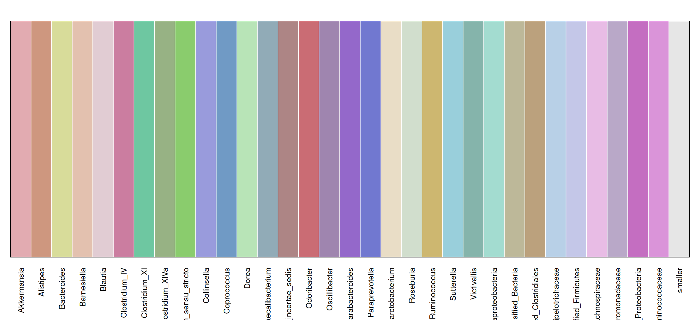
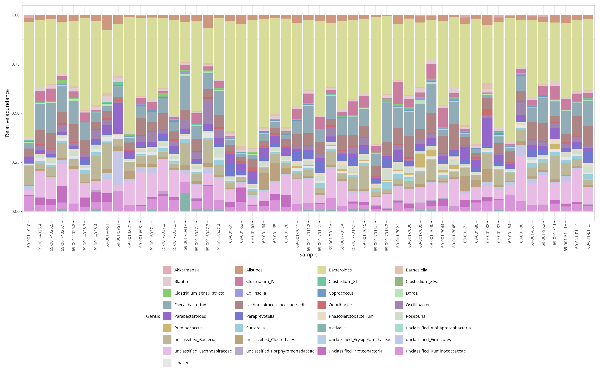

# ggqualpal

Generate perceptually distinct qualitative palettes for categorical data and
use them consistently with **ggplot2**.

`ggqualpal` wraps the palette optimisation algorithm implemented in
[`qualpalr`](https://github.com/jolars/qualpalr) and focuses on a simple
workflow for:

- mapping categories to colours
- keeping colours stable across plots
- applying the same mapping in **ggplot2**

The package is most useful when the same categorical variable appears in
multiple plots and colour consistency matters.

---

# Installation

You can install the development version from GitHub:

```r
# install.packages("remotes")
remotes::install_github("Fuschi/ggqualpal")
```

---

# Example data

`ggqualpal` includes `otu_HMP2`, a genus-level relative abundance table for one
subject across 51 samples in long format.

```r
library(ggqualpal)
library(ggplot2)

data("otu_HMP2", package = "ggqualpal")

head(otu_HMP2)
```

---

# Map genera to colours

Build one palette for all genera in the dataset and keep `smaller` fixed.

```r
levels_genus <- c(
  setdiff(unique(otu_HMP2$genus), "smaller"),
  "smaller"
)

pal <- map_qualpal(
  otu_HMP2$genus,
  levels = levels_genus,
  fixed = c(smaller = "#E6E6E6")
)

head(pal)
```

Preview the mapping:

```r
show_qualpal(pal)
```



Apply the palette back to the data:

```r
pal[otu_HMP2$genus]
```

---

# Use with ggplot2

```r
ggplot(otu_HMP2, aes(sample_id, rela, fill = genus)) +
  geom_col() +
  scale_fill_qualpal(
    limits = names(pal),
    fixed = c(smaller = "#E6E6E6")
  ) +
  theme_bw(base_size = 10) +
  theme(
    axis.text.x = element_text(angle = 90, hjust = 1, vjust = 0.5),
    legend.position = "bottom"
  )
```



---

# Generate qualitative palettes

Use `pal_qualpal()` when you only need a vector of distinct colours.

```r
pal_fun <- pal_qualpal()

pal_fun(6)
```

```r
show_qualpal(pal_fun(6))
```

---

# Why ggqualpal?

Compared with using `qualpalr` directly, `ggqualpal` provides a more direct
workflow for:

- stable category-to-colour mapping
- fixed colours for selected categories
- direct use in ggplot2 scales
- quick palette inspection with `show_qualpal()`

---

# Related packages

- `qualpalr` – perceptually optimised qualitative palettes  
- `scales` – scale tools for ggplot2  
- `colorspace` – advanced colour utilities  

---

# License

MIT © Alessandro Fuschi
